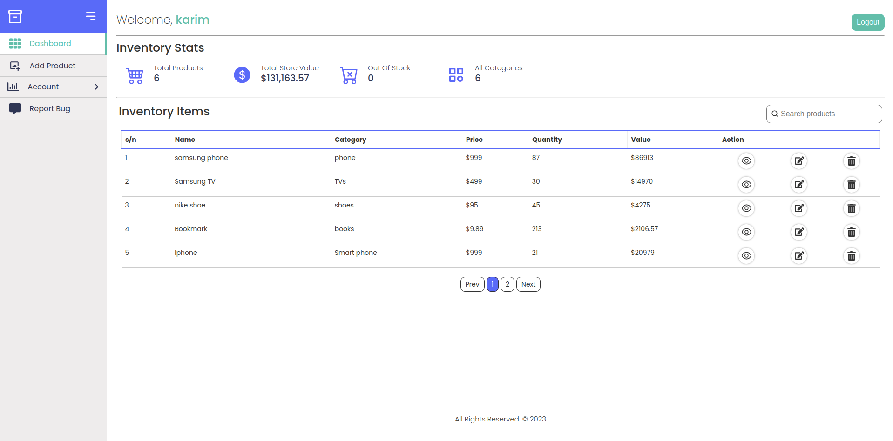

	<h1>Product Inventory Management App
	 
		
		
		
        
        
        
		 
	</h1>
	<h3> 👇 Check It Out 👇 </h3>

## 📝 Description

This my first full-stack MERN application, it took me a long time but I learned a ton. 
-The backend was built with Node and Express. 
-MongoDB for the database. 
-React and Sass for the Frontend. 

## 🛠️ Built with

- React 
- Javascript 
- Sass 
- Node.js 
- Express 
- MongoDB 
- Prettier 
- ESLint 